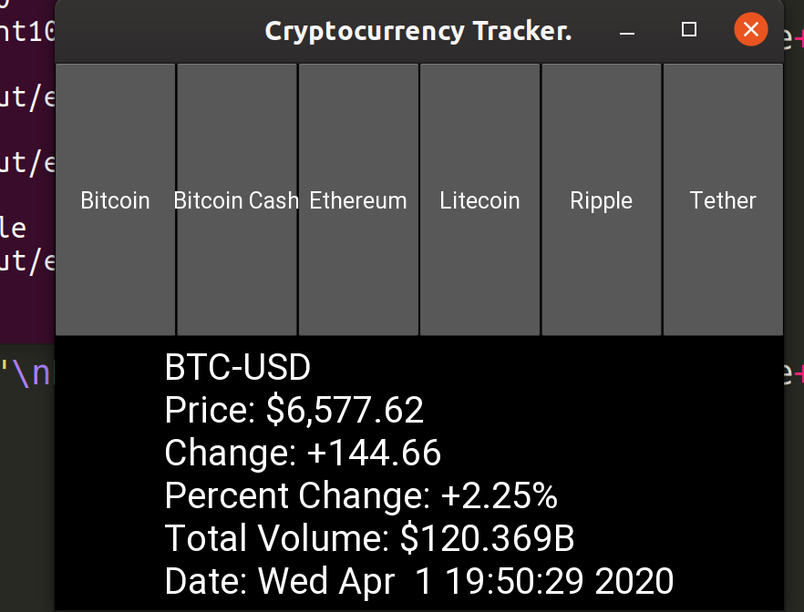

<h1>Cryptocurrency Tracker</h1>

<h2>How it works: </h2>
<ul>
<li>Fetches cryptocurrency data from Yahoo Finance using the BeautifulSoup4 html parser</li>
<li>The GUI is created using Kivi</li>
<li>The user selects which currency, he/she wants to see</li>
</ul>

<h2>Sample Run: </h2>
</img> 
</img> 
</img> 
</img> 
</img> 
</img> 
</img>

